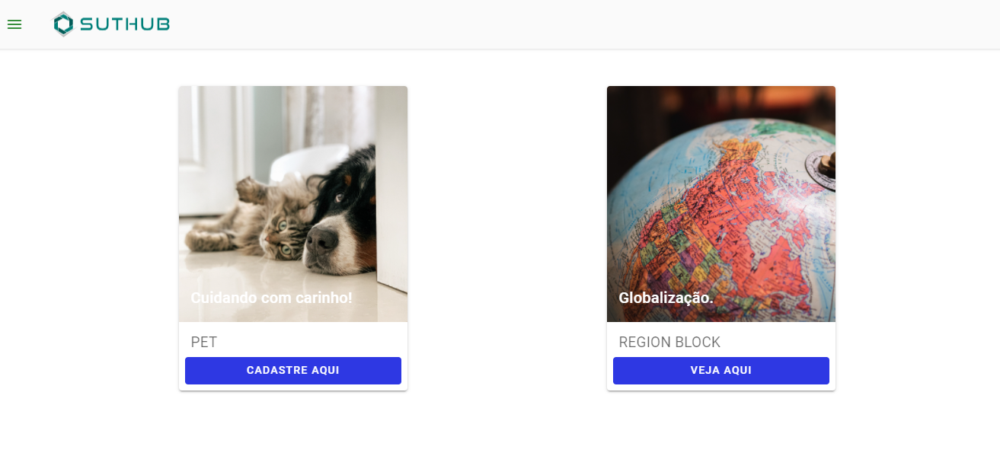

# SutHub - Challenge

<p align="center">
   
</p>

## Description in Portuguese Language

Uma aplicação web desenvolvida com as tecnologias do [VueJs] https://br.vuejs.org/ junto com a biblioteca do [vuetify] https://vuetifyjs.com/en/
Esta app construida no desafio de teste de frontend da [SutHub] https://suthub.com/ . App destinada a monstrar um modelo de dashboard de cadastro de pets e mostrar os blocos regionais e que países estão inseridos nestes blocos. Na home contém dois cards um para o cadastro de pet e outro para mostrar os blocos regionais. Na guia de pets contém um botão que abre um modal de cadastro e após inseridos os campos eles são validados e quando salvo são exibidos no console do browser em formato json. Na guia blocos regionais há um botão para exibir informações sobre o brasil em um modal, um campo de pesquisa que busca nome correto ou parte do nome de países e mostra em uma tabela os dados pesquisados, podendo clicar no idioma exibido na tabela referente a aquele país e irá buscar países com esse idioma e um campo select como uma lista de blocos regionais.

## Demo do projeto na Heroku

- https://suthub-challenge.herokuapp.com/

## Clone do projeto from github

#### Para clone do projeto é necessário ter instalado o git em sua máquina local ou fazer o download do projeto.

Após a instalação e configuração do git use o comando:

```
git clone https://github.com/gilsonrusso/suthub-challenge-frontend-vuejs.git
```

## Start do Projeto para visualização local
Podendo ser feito através do node ou docker instalados em sua máquina local.

## Usando o Node Js
na raiz do projeto utilize o comando:
```
yarn serve
```
## Usando o docker

#### para instalação e configuração do docker

 - https://docs.docker.com/engine/install/ubuntu/
 - https://docs.docker.com/docker-for-windows/install/

##### Nesta alternativa você só precisa ter o docker e docker cli instalado, em seguida rode o comando abaixo no terminal do seu editor preferido dentro da raiz do projeto.

    docker-compose up -d

Na duas alternativas a aplicação rodará na porta:
- http://localhost:8080

#### Atenção - verifique se a porta está disponivél se não há outra aplicação rodando nesta mesma porta!

### Customize configuration

See [Configuration Reference](https://cli.vuejs.org/config/).
